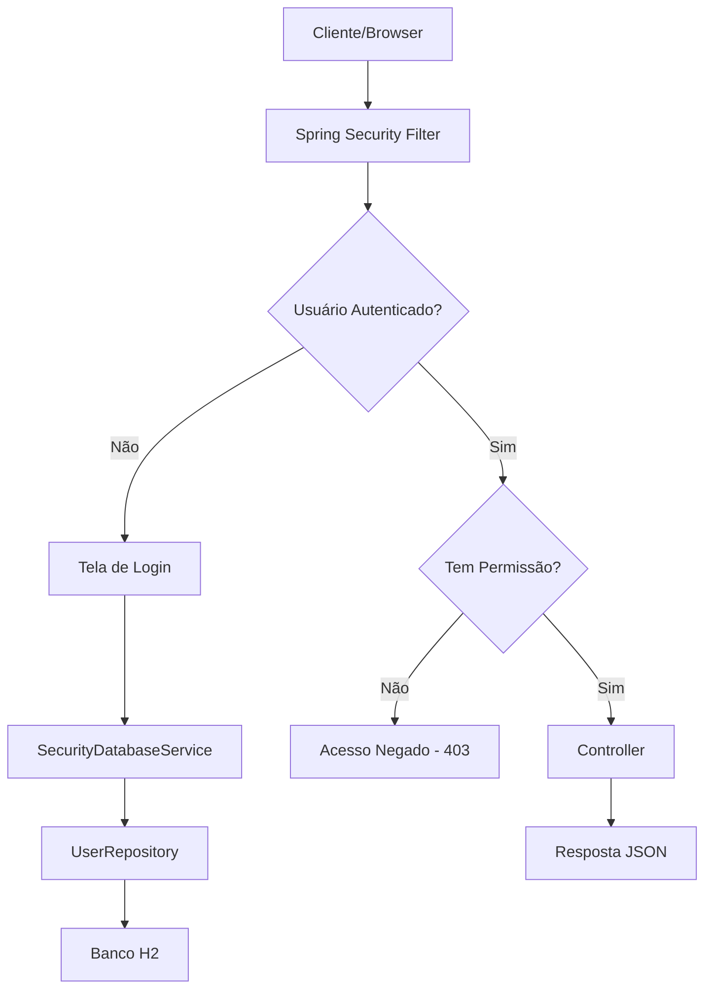

# 🛡️ Guia Completo: Spring Security com Banco de Dados

## 📋 Índice
1. [Visão Geral](#visão-geral)
2. [Arquitetura do Sistema](#arquitetura-do-sistema)
3. [Configuração do Banco](#configuração-do-banco)
4. [Modelos de Dados](#modelos-de-dados)
5. [Configuração do Spring Security](#configuração-do-spring-security)
6. [Processo de Autenticação](#processo-de-autenticação)
7. [Fluxo Completo](#fluxo-completo)
8. [Endpoints e Permissões](#endpoints-e-permissões)
9. [Testando o Sistema](#testando-o-sistema)
10. [Troubleshooting](#troubleshooting)

---

## 🎯 Visão Geral

Este projeto implementa um sistema completo de **autenticação e autorização** usando:

- **Spring Boot 3.5.3**
- **Spring Security 6.x**
- **JPA/Hibernate**
- **H2 Database (em memória)**
- **BCrypt para criptografia**
- **Role-based access control**

### 🌟 Funcionalidades Principais
- ✅ Criação de usuários via API REST
- ✅ Login com usuários do banco de dados
- ✅ Controle de acesso baseado em roles
- ✅ Senhas criptografadas com BCrypt
- ✅ Interface web de login automática

---

## 🏗️ Arquitetura do Sistema



### 📦 Componentes Principais

| Componente | Responsabilidade |
|------------|------------------|
| `WebSecurityConfig` | Configuração de segurança e rotas |
| `SecurityDatabaseService` | Busca usuários no banco para autenticação |
| `UserRepository` | Interface de acesso aos dados |
| `UsuarioController` | APIs REST para gerenciar usuários |
| `User` (Model) | Entidade JPA representando usuários |

---

## 🗄️ Configuração do Banco

### H2 Database (application.properties)
```properties
# H2 Database Configuration
spring.datasource.url=jdbc:h2:mem:testdb
spring.datasource.driverClassName=org.h2.Driver
spring.datasource.username=sa
spring.datasource.password=

# JPA Configuration
spring.jpa.database-platform=org.hibernate.dialect.H2Dialect
spring.jpa.hibernate.ddl-auto=create-drop
spring.jpa.show-sql=true

# H2 Console (para desenvolvimento)
spring.h2.console.enabled=true
spring.h2.console.path=/h2-console
```

### Estrutura das Tabelas

#### TAB_USER
| Campo | Tipo | Descrição |
|-------|------|-----------|
| ID | INTEGER (PK) | Identificador único |
| NAME | VARCHAR(50) | Nome completo |
| USERNAME | VARCHAR(20) | Login único |
| PASSWORD | VARCHAR(100) | Senha criptografada BCrypt |

#### TAB_USER_ROLES
| Campo | Tipo | Descrição |
|-------|------|-----------|
| USER_ID | INTEGER (FK) | Referência ao usuário |
| ROLES | VARCHAR | Role/permissão (USER, MANAGERS) |

---

## 📊 Modelos de Dados

### User Entity
```java
@Entity
@Table(name = "tab_user")
public class User {
    @Id
    @GeneratedValue(strategy = GenerationType.IDENTITY)
    @Column(name = "id_user")
    private Integer id;
    
    @Column(length = 50, nullable = false)
    private String name;
    
    @Column(length = 20, nullable = false)
    private String username;
    
    @Column(length = 100, nullable = false)
    private String password;
    
    @ElementCollection(fetch = FetchType.EAGER)
    @CollectionTable(name = "tab_user_roles", 
                     joinColumns = @JoinColumn(name = "user_id"))
    @Column(name = "role_id")
    private List<String> roles = new ArrayList<>();
    
    // Getters e Setters...
}
```

### UserRepository
```java
public interface UserRepository extends JpaRepository<User, Integer> {
    @Query("SELECT e FROM User e JOIN FETCH e.roles WHERE e.username= (:username)")
    public User findByUsername(@Param("username") String username);
}
```

---

## 🛡️ Configuração do Spring Security

### WebSecurityConfig - O Guardião
```java
@Configuration
@EnableWebSecurity
@EnableMethodSecurity(prePostEnabled = true)
public class WebSecurityConfig {

    @Autowired
    private SecurityDatabaseService securityDatabaseService;

    @Bean
    public PasswordEncoder passwordEncoder() {
        return new BCryptPasswordEncoder();
    }

    @Bean
    public UserDetailsService userDetailsService() {
        return securityDatabaseService;
    }

    @Bean
    public SecurityFilterChain filterChain(HttpSecurity http) throws Exception {
        http
                .userDetailsService(securityDatabaseService) // 🔑 LINHA MÁGICA!
                .csrf(csrf -> csrf
                        .ignoringRequestMatchers("/h2-console/**")
                        .disable())
                .headers(headers -> headers
                        .frameOptions(frameOptions -> frameOptions.sameOrigin()))
                .authorizeHttpRequests(authz -> authz
                        .requestMatchers("/swagger-ui/**", "/v3/api-docs/**").permitAll()
                        .requestMatchers("/h2-console/**").permitAll()
                        .requestMatchers("/usuarios/create").permitAll() 
                        .requestMatchers("/usuarios").hasAnyRole("USER", "MANAGERS")
                        .requestMatchers("/managers").hasAnyRole("MANAGERS")
                        .requestMatchers("/users").hasAnyRole("USER", "MANAGERS")
                        .requestMatchers("/").permitAll()
                        .anyRequest().authenticated())
                .formLogin(form -> form
                        .defaultSuccessUrl("/", true)
                        .permitAll())
                .logout(logout -> logout.permitAll());

        return http.build();
    }
}
```

### SecurityDatabaseService - A Ponte
```java
@Service
public class SecurityDatabaseService implements UserDetailsService {
    
    @Autowired
    private UserRepository userRepository;

    @Override
    public UserDetails loadUserByUsername(String username) throws UsernameNotFoundException {
        // 1. Busca usuário no banco
        User userEntity = userRepository.findByUsername(username);
        if (userEntity == null) {
            throw new UsernameNotFoundException("User not found: " + username);
        }
        
        // 2. Converte roles para GrantedAuthority
        Set<GrantedAuthority> authorities = new HashSet<>();
        userEntity.getRoles().forEach(role -> {
            authorities.add(new SimpleGrantedAuthority("ROLE_" + role));
        });
        
        // 3. Retorna UserDetails para o Spring Security
        return new org.springframework.security.core.userdetails.User(
                userEntity.getUsername(),
                userEntity.getPassword(),
                authorities
        );
    }
}
```

---

## 🔐 Processo de Autenticação

### 1. Criação de Usuário
```bash
# POST /usuarios/create
curl -X POST http://localhost:8080/usuarios/create \
  -H "Content-Type: application/json" \
  -d '{
    "name": "João Silva",
    "username": "joao",
    "password": "minhasenha123",
    "roles": ["USER"]
  }'
```

**Processo interno:**
1. Controller recebe o request
2. `passwordEncoder.encode("minhasenha123")` → `$2a$10$HKve...`
3. Salva no banco: `username=joao, password=$2a$10$HKve..., roles=[USER]`

### 2. Tentativa de Acesso
```bash
# GET /usuarios (protegido)
curl -X GET http://localhost:8080/usuarios
```

**Spring Security intercepta:**
1. Verifica se usuário está autenticado → ❌ Não
2. Redireciona para `/login`

### 3. Login Process
**Usuário preenche formulário:**
- Username: `joao`
- Password: `minhasenha123`

**Spring Security processa:**
1. Chama `SecurityDatabaseService.loadUserByUsername("joao")`
2. Busca no banco: `SELECT * FROM TAB_USER WHERE username = 'joao'`
3. Carrega roles: `SELECT * FROM TAB_USER_ROLES WHERE user_id = 1`
4. Valida senha: `BCrypt.matches("minhasenha123", "$2a$10$HKve...")` → ✅ True
5. Cria `UserDetails` com username, password hash e roles

### 4. Autorização
**Spring Security verifica permissões:**
- Endpoint: `/usuarios`
- Requer: `hasAnyRole("USER", "MANAGERS")`
- Usuário tem: `ROLE_USER`
- Resultado: ✅ **AUTORIZADO**

---

## 🌊 Fluxo Completo

```
1. 👤 Usuário: "Quero acessar /usuarios"
   ↓
2. 🛡️ Spring Security: "Verificando autenticação..."
   ↓
3. ❌ "Não autenticado! Redirecionando para /login"
   ↓
4. 🖥️ Mostra tela de login
   ↓
5. 👤 Usuário: "joao / minhasenha123"
   ↓
6. 🔍 SecurityDatabaseService.loadUserByUsername("joao")
   ↓
7. 💾 UserRepository.findByUsername("joao")
   ↓
8. 📊 SQL: "SELECT * FROM TAB_USER WHERE username = 'joao'"
   ↓
9. ✅ Usuário encontrado: {id: 1, username: joao, password: $2a$10$..., roles: [USER]}
   ↓
10. 🔐 BCrypt.matches("minhasenha123", "$2a$10$...")
    ↓
11. ✅ "Senha correta!"
    ↓
12. 🎭 Cria authorities: [ROLE_USER]
    ↓
13. 📝 Retorna UserDetails para Spring Security
    ↓
14. 🛡️ Spring Security: "Usuário autenticado! Verificando autorização..."
    ↓
15. 🎯 "/usuarios requer hasAnyRole('USER', 'MANAGERS')"
    ↓
16. ✅ "Usuário tem ROLE_USER - AUTORIZADO!"
    ↓
17. 🎉 Acesso liberado para /usuarios
```

---

## 🚪 Endpoints e Permissões

### 🔓 Públicos (sem autenticação)
- `GET /` - Página inicial
- `POST /usuarios/create` - Criar usuário
- `GET /h2-console/**` - Console do banco H2
- `GET /swagger-ui/**` - Documentação da API
- `GET /v3/api-docs/**` - OpenAPI specs

### 🔒 Protegidos

#### USER + MANAGERS
- `GET /usuarios` - Listar usuários
- `GET /usuarios/{username}` - Buscar por username
- `DELETE /usuarios/{id}` - Deletar usuário
- `GET /users` - Endpoint de usuários

#### Apenas MANAGERS
- `GET /managers` - Endpoint exclusivo para managers

---

## 🧪 Testando o Sistema

### 1. Criando Usuários

#### Usuário comum
```bash
curl -X POST http://localhost:8080/usuarios/create \
  -H "Content-Type: application/json" \
  -d '{
    "name": "User Comum",
    "username": "user",
    "password": "user123",
    "roles": ["USER"]
  }'
```

#### Manager
```bash
curl -X POST http://localhost:8080/usuarios/create \
  -H "Content-Type: application/json" \
  -d '{
    "name": "Admin Manager",
    "username": "admin",
    "password": "admin123",
    "roles": ["MANAGERS"]
  }'
```

#### Super usuário (múltiplas roles)
```bash
curl -X POST http://localhost:8080/usuarios/create \
  -H "Content-Type: application/json" \
  -d '{
    "name": "Super Admin",
    "username": "super",
    "password": "super123",
    "roles": ["USER", "MANAGERS"]
  }'
```

### 2. Testando Autenticação

#### Acessar endpoint protegido
```bash
# Deve redirecionar para login
curl -X GET http://localhost:8080/usuarios
```

#### Login via browser
1. Acesse: `http://localhost:8080/usuarios`
2. Será redirecionado para `/login`
3. Use as credenciais criadas
4. Após login, será redirecionado para `/usuarios`

### 3. Verificando no H2 Console

1. Acesse: `http://localhost:8080/h2-console`
2. Configure:
   - JDBC URL: `jdbc:h2:mem:testdb`
   - Username: `sa`
   - Password: (vazio)

3. Execute queries:
```sql
-- Ver usuários
SELECT * FROM TAB_USER;

-- Ver roles
SELECT * FROM TAB_USER_ROLES;

-- Join completo
SELECT u.USERNAME, u.NAME, r.ROLES 
FROM TAB_USER u 
JOIN TAB_USER_ROLES r ON u.ID = r.USER_ID;
```

---

## 🔧 Troubleshooting

### Problema: Login não funciona

#### Sintomas
- Tela de login aparece mas não autentica
- Não há logs no console

#### Diagnóstico
```java
// Adicione logs no SecurityDatabaseService
System.out.println("🔍 Buscando usuário: " + username);
```

#### Possíveis causas
1. **UserDetailsService não configurado**
   ```java
   // Verifique se tem esta linha no SecurityFilterChain
   .userDetailsService(securityDatabaseService)
   ```

2. **Usuário não existe no banco**
   ```sql
   SELECT * FROM TAB_USER WHERE USERNAME = 'seuusuario';
   ```

3. **Senha não criptografada**
   ```java
   // Certifique-se de usar BCrypt na criação
   passwordEncoder.encode(request.getPassword())
   ```

### Problema: Acesso negado após login

#### Sintomas
- Login funciona
- Erro 403 Forbidden

#### Diagnóstico
```sql
-- Verifique as roles do usuário
SELECT r.ROLES FROM TAB_USER_ROLES r 
JOIN TAB_USER u ON r.USER_ID = u.ID 
WHERE u.USERNAME = 'seuusuario';
```

#### Possíveis causas
1. **Role incorreta**
   ```java
   // Verifique se está adicionando o prefixo ROLE_
   new SimpleGrantedAuthority("ROLE_" + role)
   ```

2. **Configuração de autorização**
   ```java
   // Verifique se a role está na configuração
   .requestMatchers("/usuarios").hasAnyRole("USER", "MANAGERS")
   ```

### Problema: Referência circular

#### Sintomas
```
BeanCurrentlyInCreationException: Requested bean is currently in creation
```

#### Solução
```java
// Use apenas uma configuração de UserDetailsService
@Bean
public UserDetailsService userDetailsService() {
    return securityDatabaseService;
}

// E force no SecurityFilterChain
.userDetailsService(securityDatabaseService)
```

---

## 📚 Conceitos Importantes

### BCrypt
- **Algoritmo de hash** unidirecional
- **Salt automático** para cada senha
- **Custo configurável** (padrão: 10 rounds)
- **Exemplo**: `minhasenha123` → `$2a$10$HKveMkOJNYgQ1yFsHoH3FO...`

### UserDetails vs User
- **UserDetails**: Interface do Spring Security
- **User (nosso)**: Entidade JPA do banco
- **User (Spring)**: Implementação padrão de UserDetails

### GrantedAuthority
- **Interface** para representar permissões
- **SimpleGrantedAuthority**: Implementação simples
- **Convenção**: Prefixo `ROLE_` (ex: `ROLE_USER`)

### @EnableMethodSecurity
- **Habilita** anotações como `@PreAuthorize`
- **Exemplo**: `@PreAuthorize("hasRole('MANAGERS')")`

---

## 🎉 Conclusão

Este sistema fornece:

- ✅ **Autenticação completa** com banco de dados
- ✅ **Autorização granular** baseada em roles
- ✅ **Segurança robusta** com BCrypt
- ✅ **APIs REST** para gerenciamento
- ✅ **Interface web** automática
- ✅ **Logs detalhados** para debug

### 🚀 Próximos Passos

1. **JWT Tokens** para APIs stateless
2. **OAuth2/OIDC** para integração externa
3. **LDAP/Active Directory** para empresas
4. **Two-Factor Authentication** para segurança extra
5. **Audit trail** para rastreamento de ações

---

**📅 Criado em:** Junho 2025  
**🔧 Tecnologias:** Spring Boot 3.5.3, Spring Security 6.x, JPA, H2  
**👨‍💻 Status:** Funcional e testado ✅
